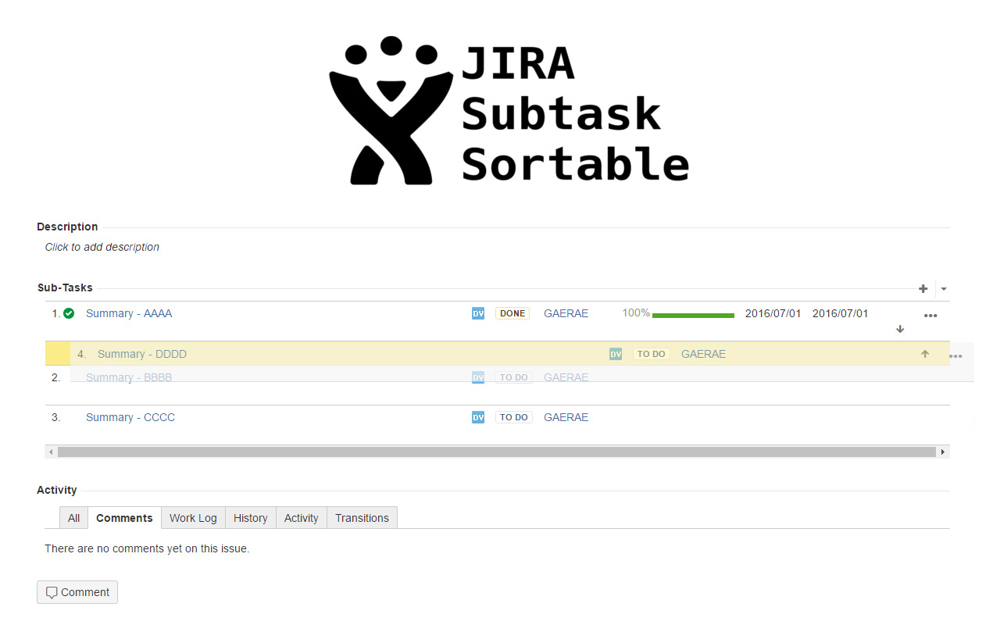

# JIRA Subtask Sortable

지라 서브 테스크를 드래그&드롭으로 정렬 순서를 변경할 수 있습니다.

"JIRA Subtask Sortable" is a subtle enhancement for JIRA Subtasks. This allows you to move them by dragging and dropping, rather than using the annoying little arrows. After you've dragged the subtask to the desired location, its location will be transparently saved so no reloading is required.

## Installation

Available for installation from the Chrome Extension Store.

## Features
* drag and drop for subtask

## License
* This chrome extension is released under the *MIT* license. Please see [LICENSE](LICENSE) for more information.
* JIRA icon resource from [Amadeze](http://plainicon.com/download-icon/51474/jira)

## Support
For support please create an issue here at GitHub

## Pull Requests
Feel free to submit any Pull Requests here.
Please indent using two spaces only, have a newline at the EOF and use UNIX line ending, thanks!

## Screenshot

